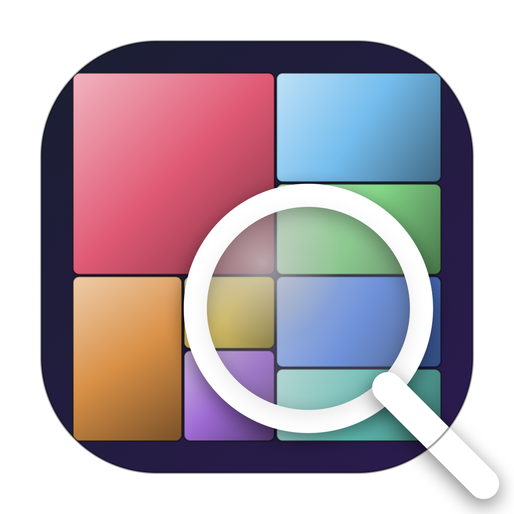

# DiskLens

A native macOS disk usage analyzer. Visualize what's eating your disk space with a squarified cushion treemap, drill into folders, and reclaim space with a single click.

Inspired by [WinDirStat](https://windirstat.net) and [Disk Inventory X](http://www.derlien.com), built fresh for modern macOS in SwiftUI + AppKit.



## Features

- **Squarified cushion treemap** — every file is a colored, pillow-shaded tile sized proportionally to its bytes on disk. Sibling groups butt up against each other; per-tile borders provide separation.
- **Folder outline** — fast NSOutlineView with Name / Size / Percent / Items columns. Cmd/Shift-click for multi-selection.
- **File-type categories** — 10 categories (Video, Audio, Image, Document, Code, Archive, Application, Data, System, Other) with stable colors used in both the treemap and the storage bar.
- **Storage summary card** — a single horizontal stacked bar à la *About This Mac*, with a free-space tail when the scan root is a whole volume.
- **Selection metadata** — name, abbreviated path, size, percentage of total, kind/extension or file/folder counts, modified and created dates.
- **Live QuickLook preview** — toggleable preview pane backed by `QLPreviewView` for any image, video, PDF, or text file.
- **Welcome modal** — non-dismissible startup sheet that asks what to scan: home folder, any folder, or any mounted volume. Live Full Disk Access status with a one-click deep link to System Settings.
- **Multi-select everywhere** — Cmd/Shift-click in the outline or treemap, with the selection echoed in the side pane, status bar, treemap highlight, and context menu.
- **Right-click context menu** — Open, Quick Look, Reveal in Finder, Show in Terminal, Copy Path, Copy Name, Zoom Treemap to Here, Move to Trash. All actions are multi-selection-aware.
- **Move to Trash** — confirms with count + total size, sorts deletes leaf-first, reports per-item failures, and updates the tree, treemap, legend, and status bar live.

## Requirements

- macOS 13 or later
- Swift 5.9 / Xcode Command Line Tools

For permission-prompt-free scans, grant DiskLens **Full Disk Access** in *System Settings → Privacy & Security → Full Disk Access*. The welcome modal links you straight there and detects when the grant lands.

## Building from source

```sh
git clone https://github.com/jturnbach/disklens
cd disklens
./build_app.sh           # builds DiskLens.app into ./build
./build_dmg.sh           # packages an installable DMG
open build/DiskLens-1.0.0.dmg
```

The build is a vanilla Swift Package — no Xcode project required.

```sh
swift build -c release   # if you just want the binary
```

### Regenerating the app icon

The app icon is generated from `Resources/make_icon.swift`, a tiny CoreGraphics script that renders all ten required sizes and produces an `iconset` directory. To rebuild it:

```sh
cd Resources
swift make_icon.swift AppIcon.iconset
iconutil --convert icns AppIcon.iconset --output AppIcon.icns
```

## Architecture

DiskLens is a single Swift Package executable target at `Sources/DiskLens/`.

| File | Role |
| --- | --- |
| `DiskLensApp.swift` | `@main` SwiftUI scene, AppDelegate, command menu |
| `ContentView.swift` | Root layout, `AppModel` (state + scan/trash logic), toolbar, status bar, progress strip |
| `WelcomeView.swift` | Startup sheet with scan options and FDA flow |
| `Permissions.swift` | Detects Full Disk Access by probing the TCC database |
| `Scanner.swift` | Iterative, cancellable directory walker on a background queue |
| `FileNode.swift` | Reference-typed tree node — mutated in place during scan and trash |
| `FileTypeClassifier.swift` | Extension → category → color mapping |
| `Treemap.swift` | Squarified treemap layout (Bruls/Huijing/van Wijk 1999) + Canvas-rendered cushion shading + AppKit hit testing layer |
| `OutlineView.swift` | NSOutlineView wrapper with multi-selection and a context menu subclass |
| `SidePane.swift` | Storage card with stacked bar + dot legend, selection metadata card, optional preview card |
| `PreviewPane.swift` | Thin `QLPreviewView` wrapper |
| `ContextMenu.swift` | Shared right-click menu builder. `ClosureMenuItem` is an `NSMenuItem` subclass that owns its closure (NSMenuItem.target is weak — external trampolines disappear) |
| `ByteFormatter.swift` | Shared `ByteCountFormatter` |

### Why not SwiftUI's `OutlineGroup`?

Native SwiftUI list rendering does not scale to the hundreds of thousands of nodes a real-world directory scan produces. `NSOutlineView` does, with row-recycling and lazy disclosure.

### Why a Canvas treemap and not per-rect SwiftUI shapes?

A folder like `/Applications` produces several thousand visible tiles. Building thousands of `Path` views per render makes SwiftUI's diffing intractable. `Canvas` flattens to a single drawing layer and is itself flattened with `.drawingGroup()` for a Metal-backed cache.

### Why a custom NSMenuItem subclass for context menus?

`NSMenuItem.target` is a *weak* reference. Closure trampolines stored in any external collection get released when AppKit copies/displays the menu. `ClosureMenuItem` stores the closure as a stored property and sets `self.target = self`; the owning NSMenu strongly retains the item, so the closure is guaranteed alive at click time.

## License

MIT — see `LICENSE` if present.
